최종 Project

## The Actor Data Base (TADB)

### 목차

- [실행 방법](#실행 방법)

- [프로젝트 소개](#프로젝트 소개)
- [프로젝트 진행](#프로젝트 진행)
- [결과물](#결과물)
- [느낀점](#느낀점)

### 실행 방법

1. 백엔드(final-pjt-back / Django)

   ```bash
   $ python -m venv venv				# 가상환경 설치
   $ source venv/Scripts/activate		# 가상환경 활성화
   $ pip install -r requirements.txt	# 가상환경에 필요 패키지 설치
   $ python manage.py migrate			# Migrate
   # 덤프데이터(발표시 사용) DB에 받아오기
   $ python manage.py loaddata dumpdata/movies.json dumpdata/actors.json dumpdata/characters.json dumpdata/users.json dumpdata/comments.json
   ```

2. 프론트엔드(final-pjt-front / Vue)

   ```bash
   $ npm install						# vue 설치
   $ npm run serve						# vue 실행
   ```

   

## 프로젝트 소개

### 주제선정

 팀원 모두 영화를 좋아하기에 많은 의견을 교환한 끝에 영화를 결정하는데 주연배우의 존재가 큰 역할을 한다는 것에 공감했습니다. 그리고 기존 대부분의 영화 사이트가 영화를 중심으로 구성되어 있기에 차별화를 두고자 배우를 중점으로 영화를 추천하는 사이트를 만들고자 했습니다.

### 제목의 뜻

 TADB는 데이터를 제공해주는 영화 사이트인 TMDB에서 모티브를 따서 지었습니다. TMDB가 영화 데이터 베이스라면, TADB는 배우들을 기준으로 영화를 추천하는 사이트라는 의미입니다.

### 사이트의 구성

 단순히 배우들이 출현한 영화들의 목록만을 보여주기보다 배우가 연기한 각 작품 속 배역에 평점을 등록하여 **자체 DB 구성**을 목표로 했습니다. 구체적으로는 하나의 배역에 대한 평점들을 기반으로 배역평점이 정해지고 그리고 배우의 배역들의 평점을 기반으로 배우의 평점이 이어지는 시스템으로 구성했습니다.

 사이트의 모든 구성과 내용은 등록된 평점을 기준으로 제공됩니다. 시작화면에는 배우 평점이 가장 높은 20인의 목록이 배우평점 순으로 제공되며 기본 추천 영화는 해당 상위 20인의 배우 중 1인의 배역 평점이 가장 높은 영화 3작품이 제공되고 있습니다.

 그리고 검색 시스템을 제공하여 상위 20인의 배우 외에 원하는 배우를 검색하여 해당 배우의 상세 정보로 향할 수 있게 경로를 제공했습니다. 배우의 상세 정보 페이지에서는 배우를 선호배우로 등록할 수도 있고 각 배우의 출연작과 그 배역에 대한 평점이 제공되며 댓글의 형식으로 평점을 등록할 수 있습니다.

 마지막으로 계정별 프로필 페이지에서는 선호배우로 등록한 목록을 보여줍니다. 그리고 선호배우로 등록할 경우 메인 화면 추천 작품이 상위 20인의 배우 중 임의로 선택되는 것이 아닌 선호배우로 등록한 배우들 중 임의의 한 명이 선정되어 마찬가지로 그 배우의 배역 평점이 높은 영화 3편이 제공됩니다.    

또한 평가된 배우들의 총점을 기준으로 서비스 이용자들에게 소개를 해주는 차원에서 첫 화면에 배우의 총점을 순서대로 높은 순이 가장 위에 나타나도록 하였습니다. 또한 평점이 높은 배우들 중 한 명을 랜덤 추첨하여 가장 상단에 표시하고 그 배우가 출현한 대표작들을 소개해주도록 하였습니다.

 모든 사이트의 정보를 제공하는 기준을 자체적으로 구축한 DB를 기준으로 제공하여 단순히 TMDB에서 DB를 받아서 사용하는 1차적인 활용에서 나아가 2차적으로 자체 DB를 구성하여 제공하는 사이트로 제작했습니다.


## 프로젝트 진행

### 개발 환경

-  언어
   1. Python 
      - Django(3.2.12)
      - Rest Framework
      - Requests
      - Pandas
      - Django RestAuth
      - Lodash
   2. JavaScript
      - Vue 2
      - Vuex
      - Vue Router
      - Bootstrap
      - Ajax
-  도구 
   1. Visual Studio Code 
   2. Chrome Browser 
   3. Kakao Oven
   4. ERD Cloud
   5. Notion
   6. Gitlab


### 기획

#### ERD 제작

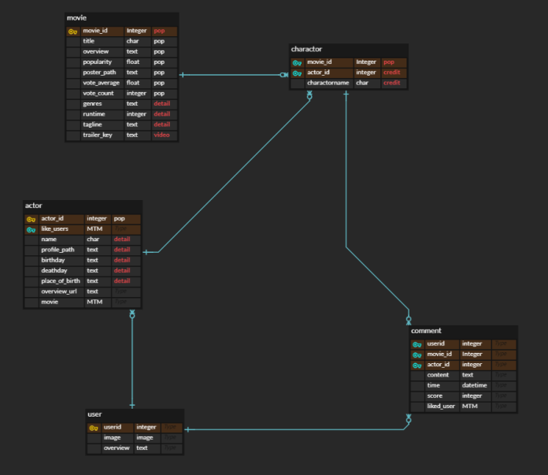


#### 기초 도안(기획 당시)

- 기본 페이지

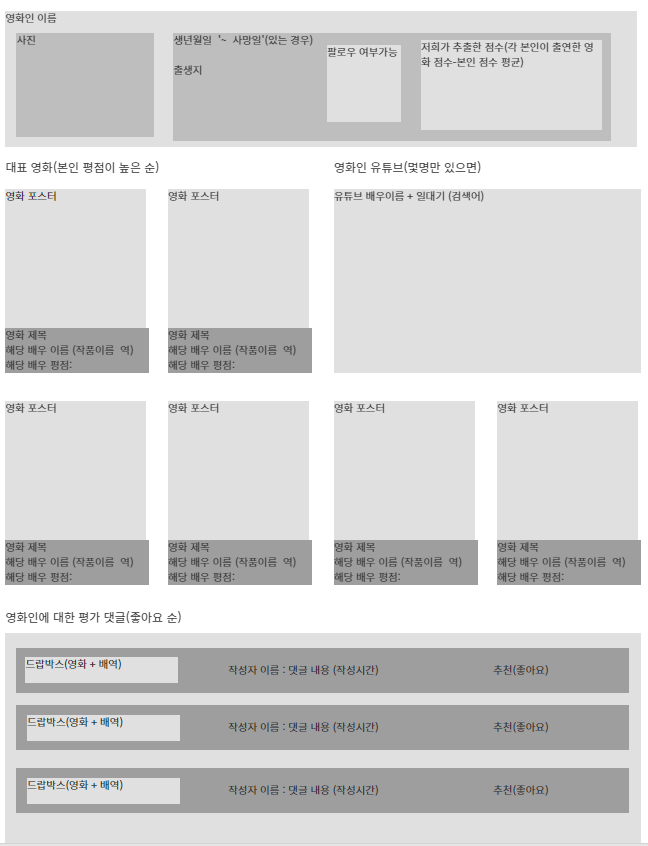

컴포넌트

1. 네비게이션바View(모든 콤퍼넌트 공통)
   - 데이터: 개인 로그인 정보: 로그인 시('' 접속중, 로그아웃, 프로필 ), 비로그인(로그인, 회원가입)
2. 검색창View
   - 필요 데이터: 현재 창에서는 x
3. 추천영화 목록View(로그인 시 보이게(v-if), 로그인 x인 경우 배우 리스트가 자리를 채움)
   - 필요 데이터: 유저의 좋아요 >(역참조) 배우들 >(역참조) 등장인물(character) 중 가장 배점이 높은리스트 > 영화 정보(영화정보- poster_path, title만 사용 단, 다 넘겨야 개별 폼에서도 활용 가능)
4. 추천배우 리스트View(개인 평점이 높은 순)
   - 필요 데이터: 배우 리스트 평점순 20명 (각 배우 정보 리스트)

- 배우 디테일 페이지


컴포넌트

1. 기본 영화인 정보
   - 데이터: name, profile_path, birth_day, deathday, place_of_birth
2. 영화인 유튜브(직접입력할 데이터, 있는 몇명만 v-if)
   - 데이터: overview_url
3. 대표 영화(출연작에 대한 평점-(본인의 평점 + 작품 평점)이 높은순)
   - 데이터: character(중개필드)에서 자신의 comment 내 score평균이 가장 높은 작품 순(최대 8개)의 영화 관련 정보(title, poster_path) + 배우출연정보(character의 이름, 평점(평균),) + 배우정보(배우 이름)
4. 댓글정보(출연작의 댓글 중 좋아요가 높은 순)
   - 데이터: character 테이블에 역참조로 가장 좋아요가 높은 순으로(댓글정보: character, score, like_users.count() 수, time, content) + 영화정보(title)

- 영화 디테일 페이지

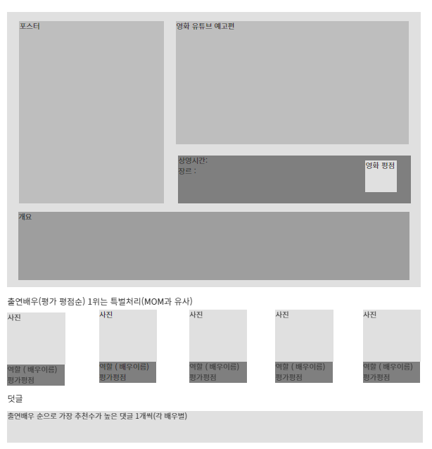

- 검색 결과 페이지

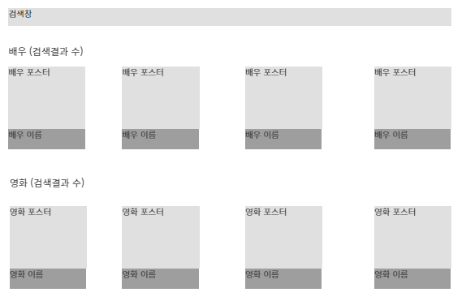

### 데이터

대규모 데이터: TMDB에서 Popular를 기준으로 1만개의 영화 데이터 구성을 목표로 했습니다. 이후 해당 영화별 주역 배우 5인의 배역 정보와 해당 배우에 대한 테이블을 구성했습니다.(실시간으로 TMDB API에 요청을보내어 DB를 작성하는 방법 사용)

소규모 데이터: 대규모 테이터를 구성하는데 시간이 소요되기에 데이터 추출과 소규모 데이터를 활용한 사이트 구성 작업을 병행적으로 진행했습니다. (csv 파일을 작성한후 데이터 베이스에 처리)


### 제작

#### 역할 분담

 팀원 모두 첫 프로젝트였기에 프론트와 백을 엄격히 구분하여 진행하기 보다 프로젝트의 전 과정을 경험해보고자 기능과 페이지별로 나누어 작업을 했고 그 결과 여러 과정을 협업하여 진행했습니다.

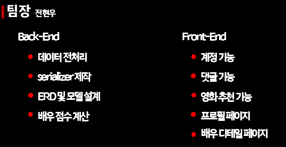


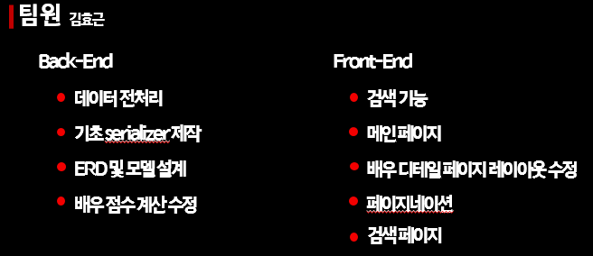

#### 진행 중 어려웠던 점

- 첫 번째 검색 후 검색 결과 창에서 재검색이 되지 않았던 점

  - 검색기능 처음 제작시 구글링을 통해 getters에서 필터링된 결과값을 반환하는 로직을 가져왔는데, 이것이 검색은 처음에 잘 되었더라도, 나중에 재검색이 되지않는 단점이 있었습니다.
  - router.go라는 것으로 새로고침하여 갱신할 수 있도록 만들었지만 로그아웃되는 단점이 있어서 이 방식을 사용하지 못 했습니다.
  - 결국 검색 로직을 다시 처음부터 작성한 뒤 재검색 기능까지 완벽하게 구현했습니다.

- 배역에 대한 댓글 기능

  - ERD를 보면 알겠지만, comment모델의 필드값들이 foreign key값들로 난무되어 있어 타 모델과 타모델의 중계모델의 PK 참조 같은 복잡한 방식을 취하고 있었기에 계획과 달리 실제 프로젝트를 진행하면서 시간 등의 이유로 배역이 아닌 배우에 대한 평점 등록으로 선회할 생각도 했습니다.
  - 사이트의 핵심은 배역을 통한 평점 부여를 기반으로 했기에 다시 수기로 데이터를 받아오고 처리하는 것에 대한 구상을 한 후 결국 원래의 계획대로 제작했습니다.   

- 배우 총 점수의 재계산

  - 처음 댓글을 통한 평점 계산을 복잡한 방법으로 사용
  - Sum이라는 것을 가져와 aggregate에 사용하여 댓글의 변화에 의해 배역의 점수가 변하면,
    배역에 대한 댓글 모두를 가져와 더하고 댓글의 개수만큼 나누어 평점을 계산하였다.
  - 또한 배우의 총평점은 모든 배역의 점수를 가져와 더하고 배역의 수만큼 나누어주었다.
  
  ```python
  from django.db.models import Sum
  # 기존의 복잡한 계산 형식(댓글 추가한 경우)
  character.score = (character.score * (len(character.comments.all())-1) + serializer.data['score']) / len(character.comments.all())
  # 용이한 계산
  def comment_create(request, characterPK):
      character = get_object_or_404(Character, pk=characterPK)
      # 평점 재계산
      actor = get_object_or_404(Actor, actor_id = character.actor_id)
      serializer = CommentSerializer(data=request.data)
      if serializer.is_valid(raise_exception=True):
          serializer.save(user=request.user, character=character)
          character.score = character.comments.aggregate(Sum('score'))['score__sum']/character.comments.all().count()
          character.save()
          actor.score = actor.character_set.aggregate(Sum('score'))['score__sum']/actor.movie.all().count()
          actor.save()
          return Response(status=status.HTTP_201_CREATED)
  ```
  
  

#### 아쉬운 점

- 배우 디테일에 들어가게 되면 배우의 정보가 많이 나왔으면 했는데 그러한 데이터를 모으지 못했다는 점이 가장 아쉽습니다. 맨 처음 기획에는 배우 수를 작게하고 해당 배우의 일대기가 들어간 유튜브 영상을 디테일 페이지에서 띄우는 생각을 하였는데 일일이 그러한 유튜브 영상을 찾는 것이 불가능하다 판단되어 취소하였습니다.
- 영화 디테일 페이지를 제작하지 못한 점이 가장 아쉽습니다.시간이 더 있었다면 제작 가능했겠지만, 시간 부족상 TMDB의 해당 영화페이지로 이동해주는 것으로 마무리 지었습니다.
- 개인 프로필 페이지를 꾸밀 수 있기 하지 못한 점도 아쉽습니다. 댓글을 통한 평점시스템을 구상하는데 너무 시간을 사용한 나머지 다양한 기능을 제공하지 못한 점이 아쉽습니다.


### 결과물

1. 메인 페이지

   NavBar 및 추천 화면(로딩 중)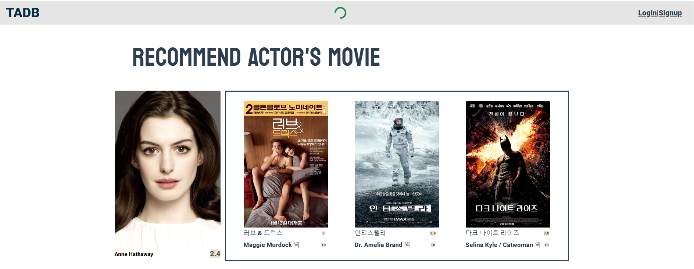

   검색화면 로딩을 마친 후

   

   배우 리스트

   

2. 검색 결과(한 페이지에 배우와 영화 검색 결과가 함께 제공)

   배우 검색 결과

   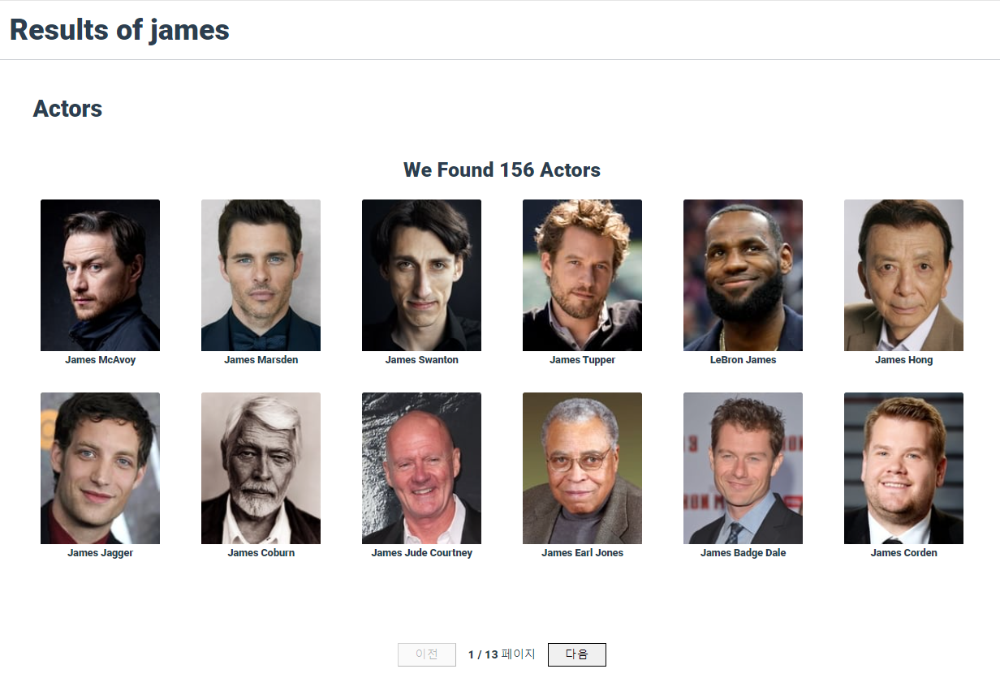

   영화 검색결과

   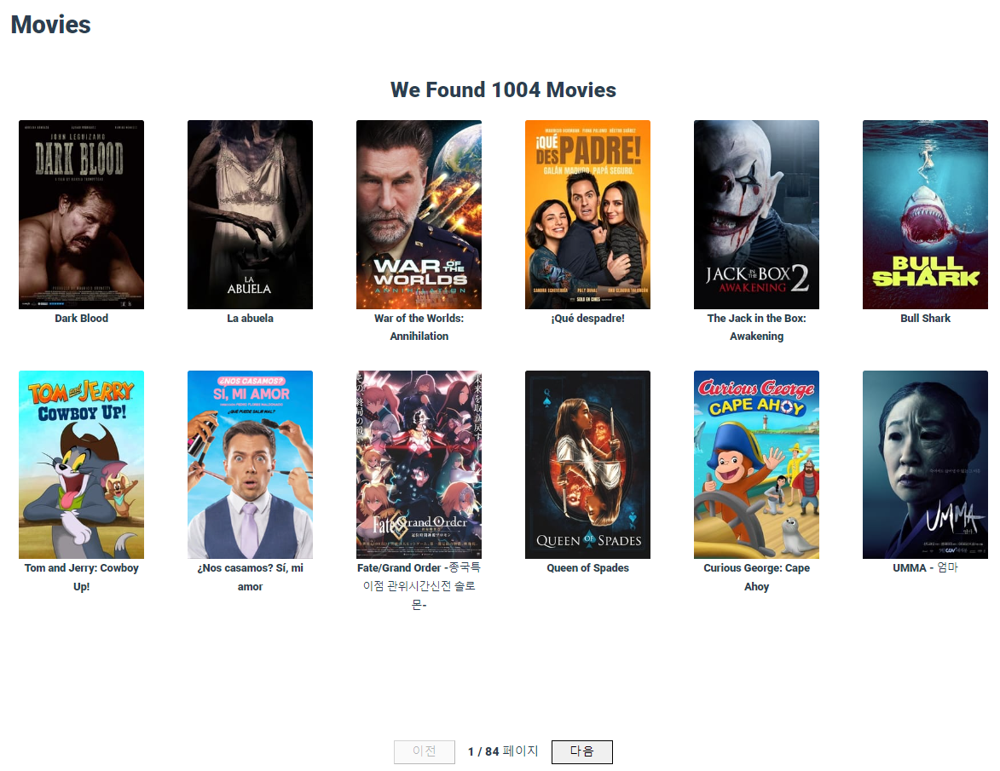

3. 계정관련 페이지

   로그인

   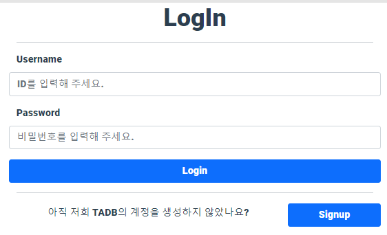

   회원가입

   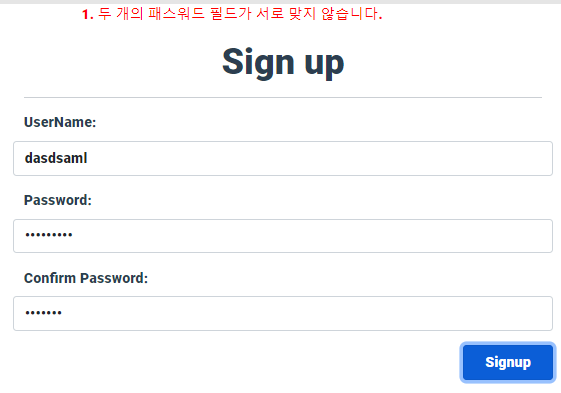

   프로필 페이지

   

4. 배우 상세 페이지(하나의 페이지에서 제공)

   배우 상세정보

   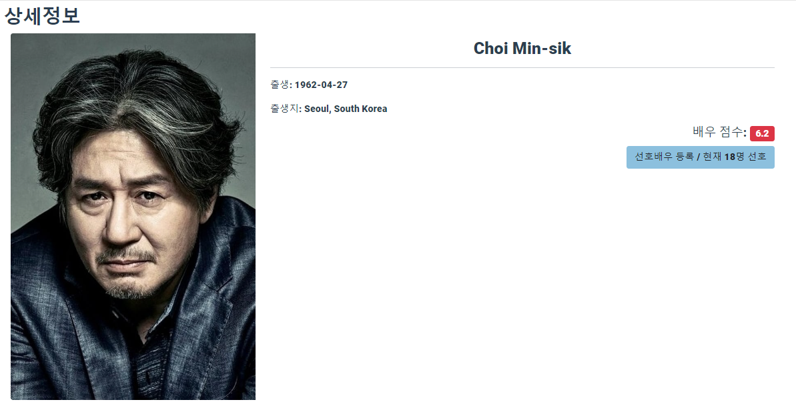

   출연작품

   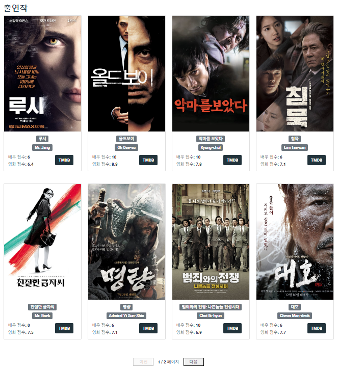

댓글 기능(평점등록)

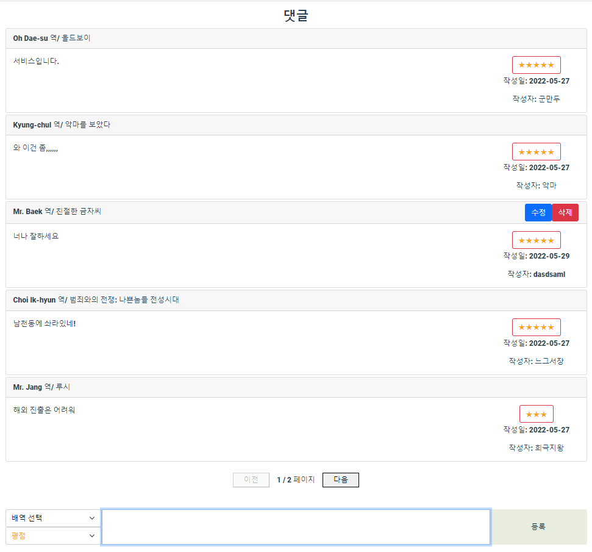


### 느낀점

- 전현우 : 

   첫 프로젝트를 통해 프로젝트는 비워내는 것이라는 점을 깨달았습니다. 처음 적당한 프로젝트 규모라고 생각했지만 진행할수록 시간적 능력적 제약으로 비워내며 필요한 부분은 남기고 그 왜의 부분은 비워냈습니다.  그리고 적당히는 용납될 수 없다라는 사실도 배웠습니다. 계획을 구상하며 적당히 이정도로 진행하면 되겠지라는 안일한 생각을 한 부분은 실제 프로젝트를 진행할 때 반드시 문제가 나고 이를 해결하기 위해 많은 시간을 허비하거나 포기해야했습니다.

   왜 백엔드 프론트엔드로 구분을 하는 것인지도 깨달았습니다. Vuex를 사용했지만, 기능과 페이지별로 나누어 작업한 결과 중첩되는 함수 등이 많았고 더 계획적으로 구상했다면 Store에서 정의하여 사용할 수 있었을 텐데하는 아쉬움이 있었습니다. 그러나 반대로 함께 의논하고 고민할 수 있었기에 평점 계산 같은 부분들을 같이 고민한 끝에 좋은 방법을 찾을 수 있었습니다.

   물론 모든 것이 부정적이진 않았습니다. 무엇보다 구체적인 성취감을 느낄 수 있었습니다. 프로그래밍에 대해 처음 배운 것이 약 5개월 정도 전이고 그때는 상상도 하지 못했던 사이트를 직접 제작하며 실력이 향상되었고 구체적으로 어떠한 것이 가능한 지 알 수 있는 좋은 기회였습니다. 

  

- 김효근

   처음 기획했을 때는 충분히 가능하다 느꼈는데 실제 제작에 돌입하면서 할 수 없다는 느낌이 강하게 들었습니다. 그럼에도 불구하고 포기하지않고 끝까지 시도하니 해결이 되었다는 점이 신기하였습니다.
   많은 동기들에게 도움을 요청하여서 해결해나갔기에 오늘 이 프로젝트를 끝냈지 않을까 싶습니다. 비록 다른 팀들의 잘만든 프로젝트에 비해 퀄리티가 떨어지고 페이지가 몇개 존재하지는 않지만 하나의 프로젝트를 만들었다는 것에 큰 의의를 두고 2학기때에 시작할 프로젝트는 조금 더 많은 팀원과 더 많은 시간이 주어지니 더 발전된 프로젝트들을 만들어 볼 것입니다.